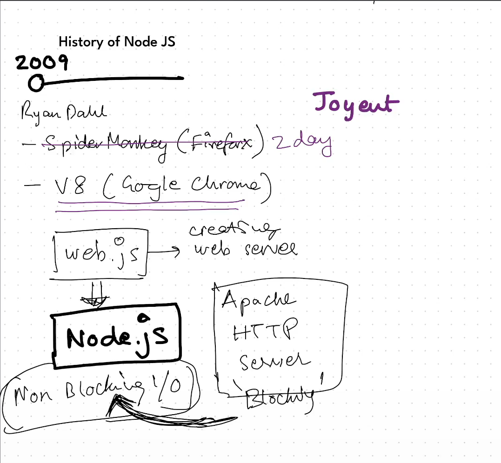

## What is NodeJs

Node.js is a cross-platform, open-source JavaScript runtime environment that can run
on Windows, Linux, Unix, macOS, and more. Node.js runs on the V8 JavaScript engine,
and executes JavaScript code outside a web browser.

Node.js is a JavaScript runtime built on Chrome's V8 JavaScript Engine.

Node.Js is founded by OpenJs Foundation

Node.js has an event-driven architecture capable of asynchronous I/O. These design
choices aim to optimize throughput and scalability in web applications with many
input/output operations, as well as for real-time Web applications (e.g., real-time
communication programs and browser games).

Asynchronous I/O = NonBlocking I/O

NodeJs was first developed by Ryan Dahl in 2009

## History of Node JS

Wherever there is JavaScript there will always be a JavaScript Engine.

1. 2009 - Ryan Dahl Developed NodeJs and he ran JavaScript Using SpiderMonkey which is a FireFox JavaScript Engine
Later on after 2 days of development he started using Google V8 Engine
Joyent Company Hired Ryan Dahl and Supported his NodeJS project

Initially Ryan named NodeJs as web.js ---> Create Web Server
Later Ryan realised the potential and renamed it as Node.js 

## Why he created Node JS ? 

Apache HTTP Server ----> It was a Blocking Server and Ryan wanted to create a Non Blocking Server and that is why Node JS in non blocking

2. 2010 - NPM was launched by an employee from Joyent
Initially there was only support for MacOs and Linux 

3. 2011 - Windows Support came for NodeJs and that was led by Joyent + Microsoft

4. 2012 - Ryan Dahl left the NodeJs Project and the responsibility was given to Isaac who was the creator on npm

5. 2014 - A Guy name Fedor created io.js and it was exactly a fork of Node js

6. 2015 - io.js and Node Js got merged and a Node JS Foundation was formed and this committee decided we will maintain Node JS project

7. 2019 - There were two committee JS Foundation and NodeJS Foundation these two got merged and a new Committee was formed OpenJS foundation and OpenJS foundation took control over the Node JS