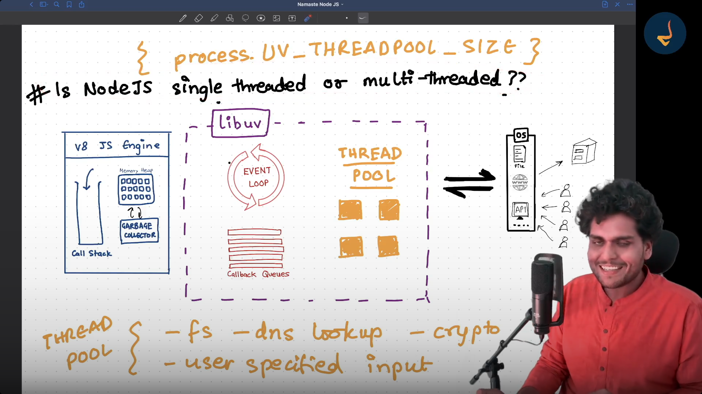
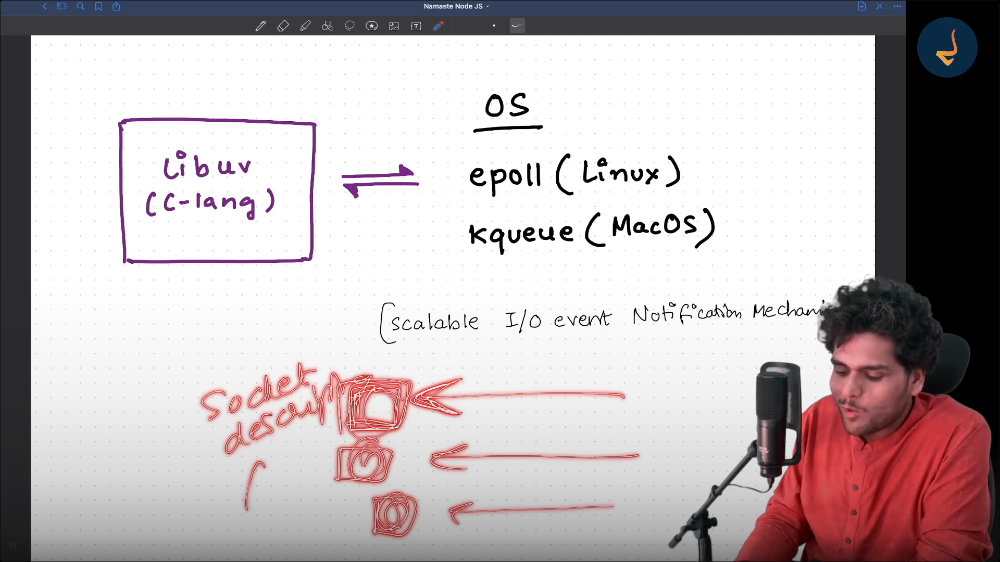
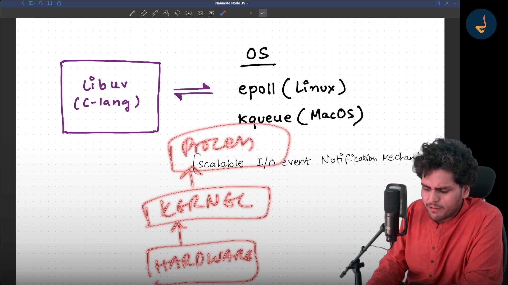
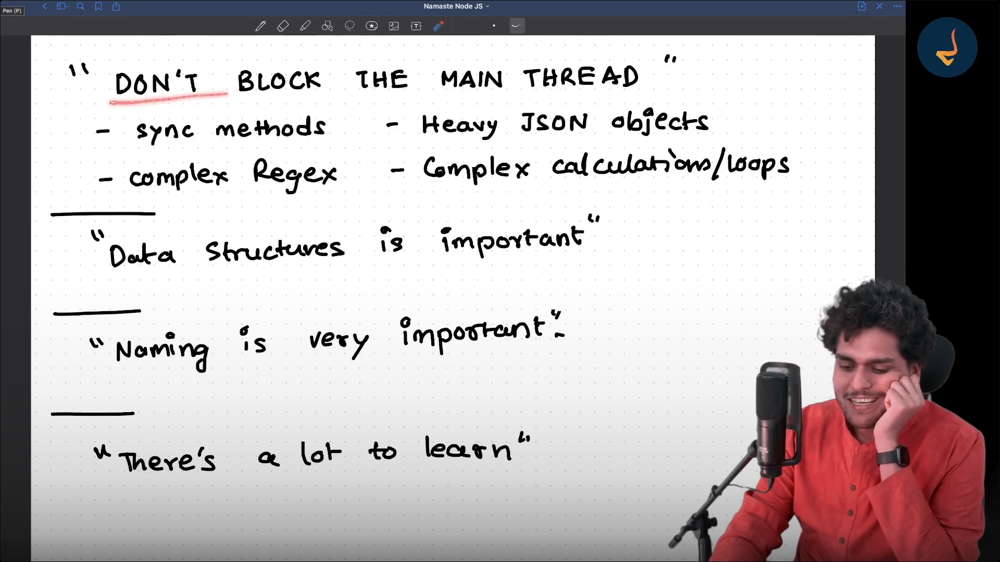

TICK - One Full Cycle of Event Loop is known as a Tick

## Libuv has 4 Threads by Default so suppose if 5 file read operations came together the 5th one has to wait till the thread pool is free 

Thread Pool is used by

1. fs
2. dns.lookup
3. crypto
4. user specified input

## Homework

1. epoll  (Linux)
2. kqueue (MacOS)
3. Scalable I/O event Notification Mechanism
4. fds - socket descriptors
5. What Data Structure is Epoll using ? 
6. EventEmitters
7. Streams & Buffers
8. Pipes

Timers Queue Uses Min Heap Datastructures
Epoll uses Red Black Tree DataStructures