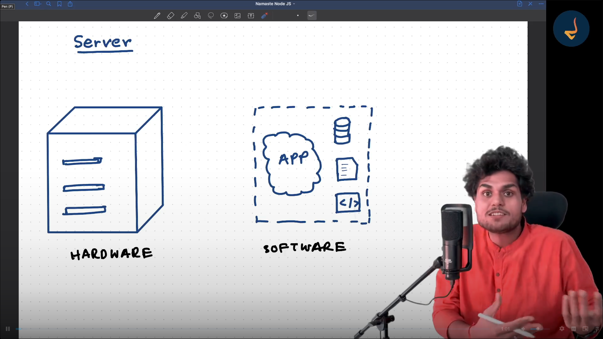

## What is Server ? 

1. Server - Hardware - AWS Server
2. NodeJs - Software - Http Server

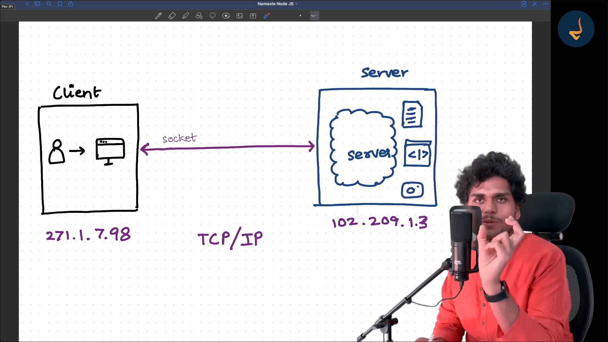

When the Socket Connection is made it uses TCP/IP Protocol - Transmission Control Protocol

IP - Internet Protocol

## Different Types of Server

1. HTTP - HyperText Transfer Protocol
2. FTP - File Transfer Protocol
3. SMTP - Simple Mail Transfer Protocol

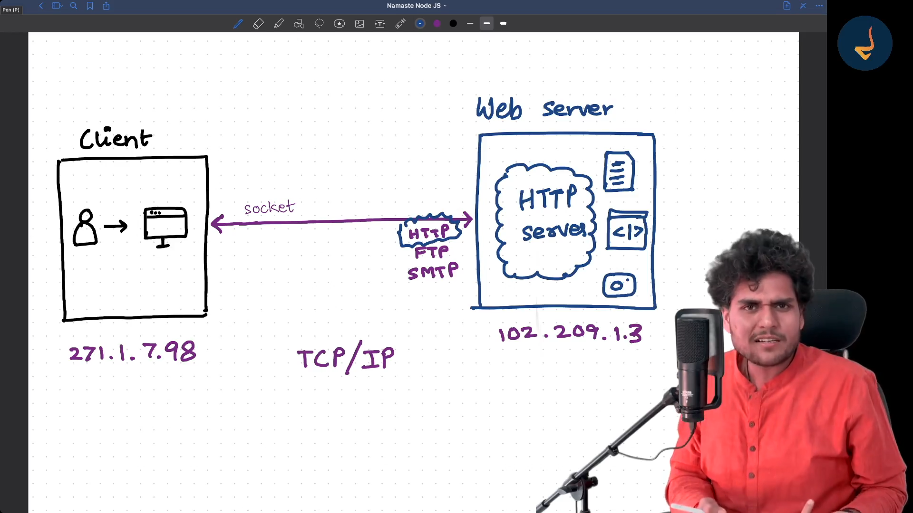

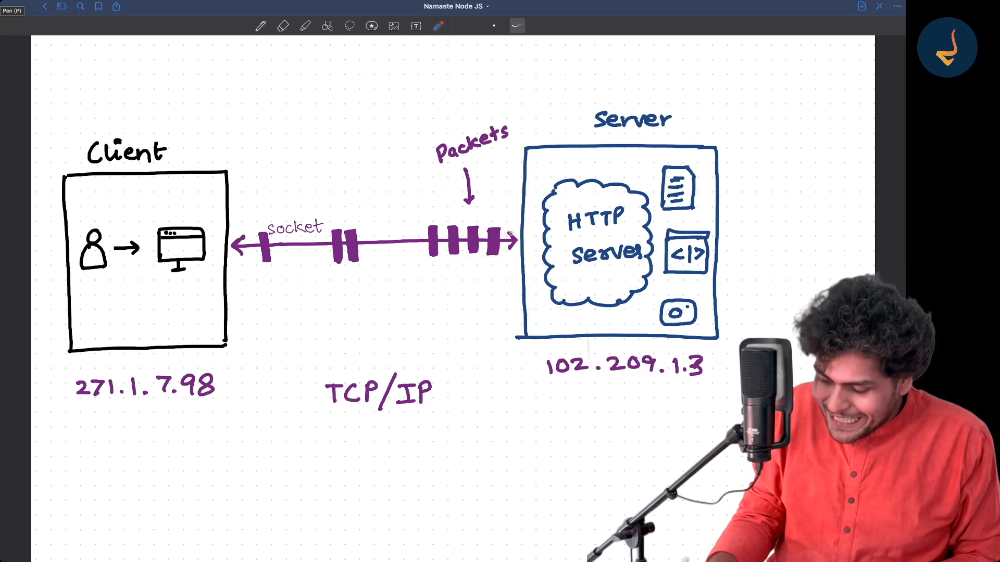

TCP/IP Protocol is the Protocol of sending the data between when the two IP Communicates

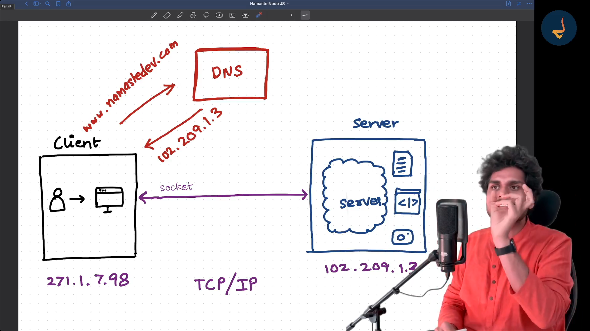

DNS - Domain Name Server

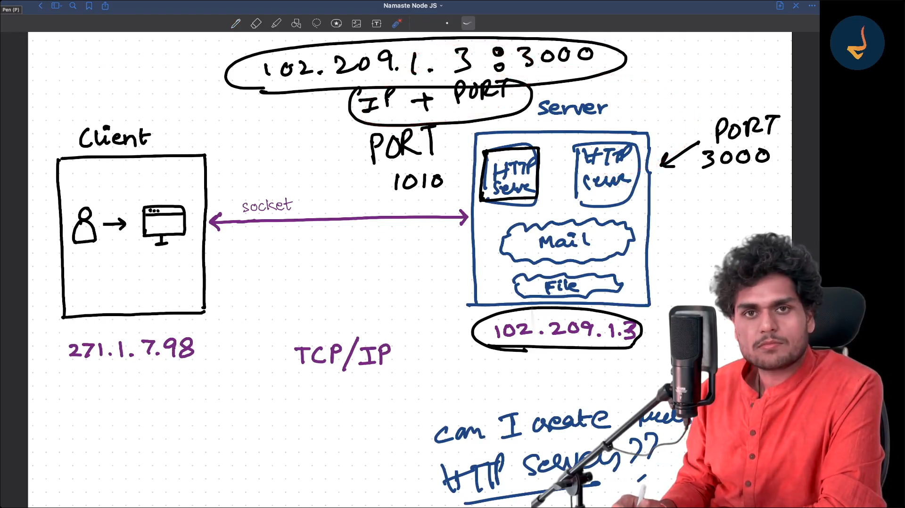

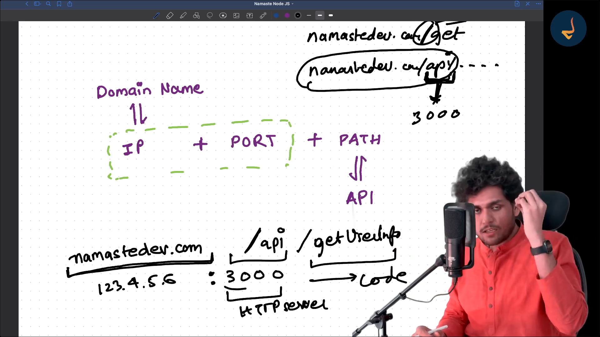

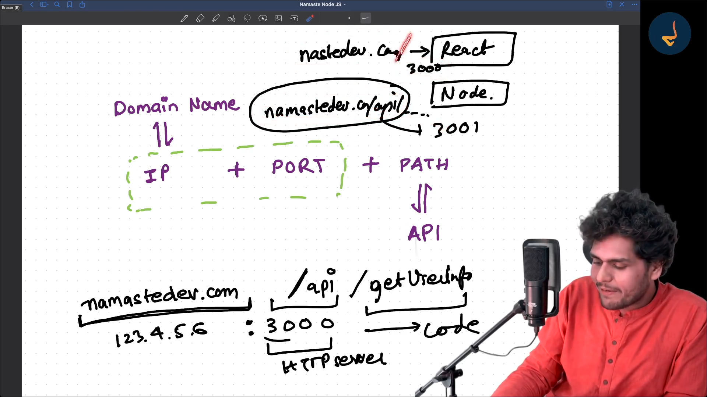

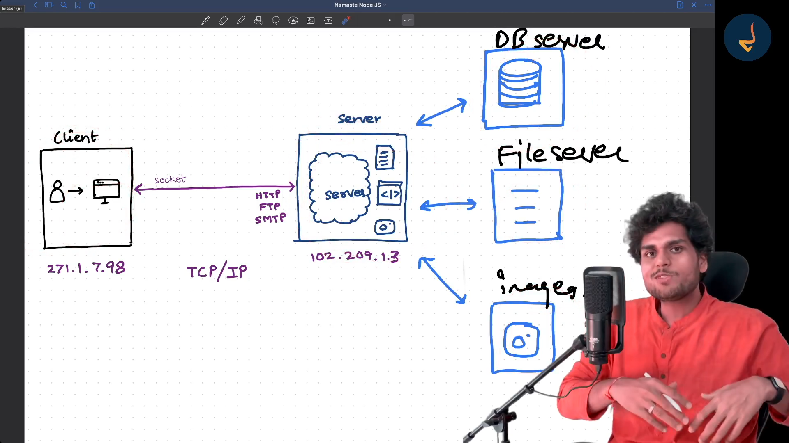

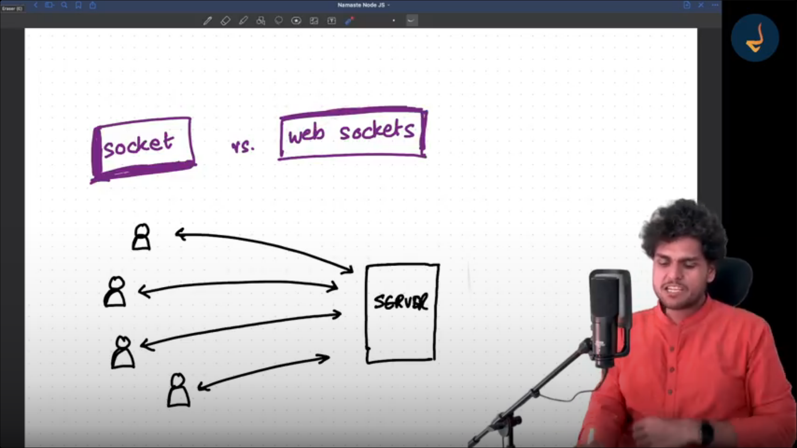

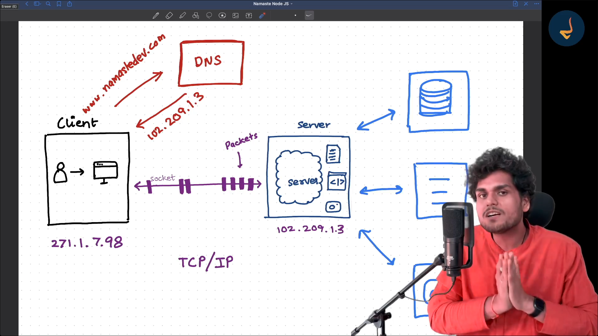