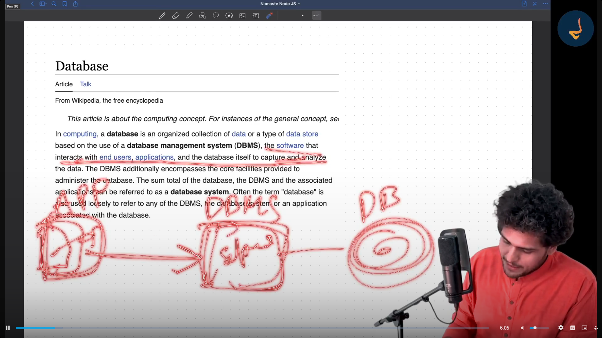
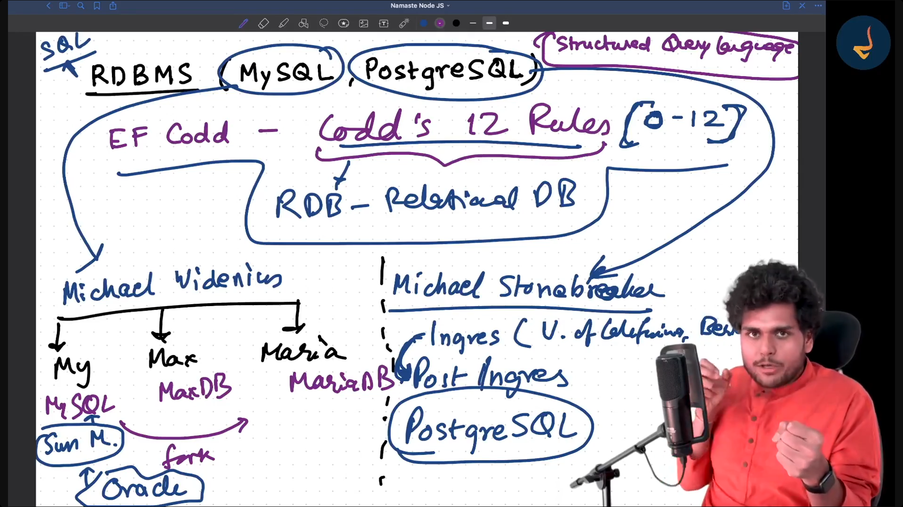
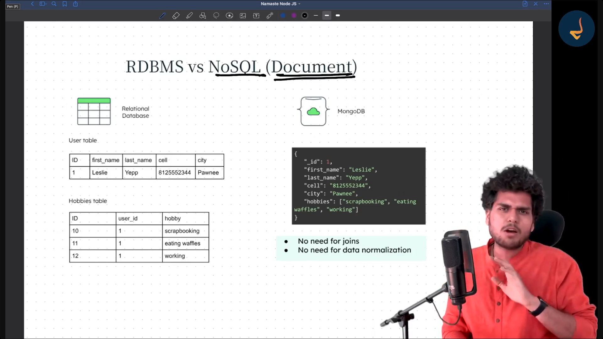

Database

This article is about the computing concept. For instances of the general concept, se

In computing, a database is an organized collection of data or a type of data store
based on the use of a database management system (DBMS), the software that
interacts with end users, applications, and the database itself to capture and analyze
the data. The DBMS additionally encompasses the core facilities provided to
administer the database. The sum total of the database, the DBMS and the associated
applications can be referred to as a database system. Often the term "database" is
also used loosely to refer to any of the DBMS, the database system or an application
associated with the database.

Types of Databases

1. Relational DB - My saL , Postgresal
2. NoSQL DB. - MongoDB
3. In memory DB - Redlis
4. Distributed SOL DB - Cockroach DB
5. Time series DB - Influx DB
6. OO DB -  db40
7. Graph DB - Neo4j
8. Hierarchial DB - 1BM IMS
9. Network DB - 10MS
10. Cloud DB - Amazon RDS

## RDBMS (MYSQL, PostgreSQL)

1. EF Codd - Codd's 12 Rules [0-12]
If you follow these 12 rules than your database is a Relational Database

## Types of NoSQL DB  (MongoDB)

1. Document DB
2. KeyValue DB
3. Graph DB
4. Wide Column DB
5. Multimodel DB

MongoDB Uses Document DB type

MongoDB Advantages

1. Flexible
2. Very Compatible with JS Stack
3. Document to JSON
4. Increases Developer Productivity

# RDBMS (MySQL) vs NoSQL (MongoDB)

| RDBMS (MySQL) | NoSQL (MongoDB) |
|---------------|-----------------|
| Tables, Rows, Columns | Collections, Documents, Fields |
| Structured Data | Unstructured Data |
| Fixed Schema | Flexible Schema |
| SQL | Mongo (MQL), Neo4j (Cypher) |
| Tough horizontal scaling | Easy to scale horizontally and vertically |
| Relationships using foreign keys and joins | Nested relationships |
| Suitable for read-heavy applications and transaction workloads | Suitable for real-time systems, big data, and distributed computing |
| **Example:** Banking applications | **Example:** Real-time analytics, social media applications |

---

## RDBMS (MySQL)

- Uses **Tables**, **Rows**, and **Columns**
- Stores **Structured Data**
- Follows a **Fixed Schema**
- Uses **SQL (Structured Query Language)**
- **Horizontal scaling** is comparatively difficult
- Relationships are managed using:
  - Foreign Keys
  - Joins
- Best suited for:
  - Read-heavy applications
  - Transaction-based workloads
- **Examples:**
  - Banking applications
  - Financial systems
  - Inventory management systems

---

## NoSQL (MongoDB)

- Uses **Collections**, **Documents**, and **Fields**
- Stores **Unstructured Data**
- Supports a **Flexible Schema**
- Uses:
  - **MongoDB → MQL (Mongo Query Language)**
  - **Neo4j → Cypher**
- Easy to scale:
  - Horizontally
  - Vertically
- Supports **Nested Relationships**
- Best suited for:
  - Real-time applications
  - Big data processing
  - Distributed computing
- **Examples:**
  - Real-time analytics
  - Social media applications
  - Content management systems

---

## Quick Comparison

| Feature | RDBMS (MySQL) | NoSQL (MongoDB) |
|----------|---------------|-----------------|
| Data Model | Tables | Documents |
| Data Type | Structured | Unstructured / Semi-structured |
| Schema | Fixed | Flexible |
| Query Language | SQL | MQL |
| Scaling | Difficult horizontal scaling | Easy horizontal scaling |
| Relationships | Foreign Keys + Joins | Nested Documents |
| Ideal Use Cases | Banking, Transactions | Analytics, Social Media, Big Data |

> **Note:** In practice, MongoDB often stores **semi-structured data** rather than completely unstructured data.