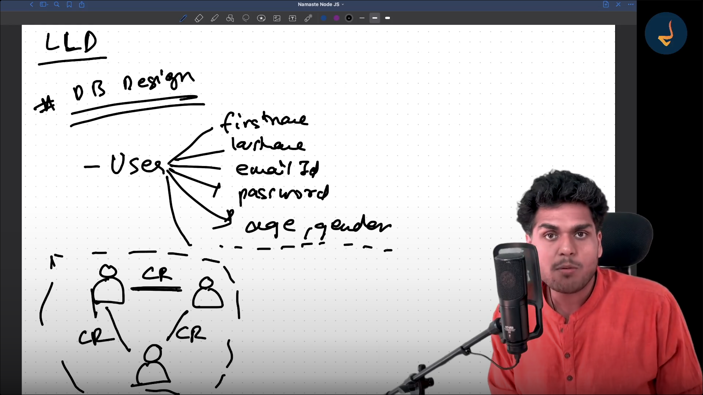
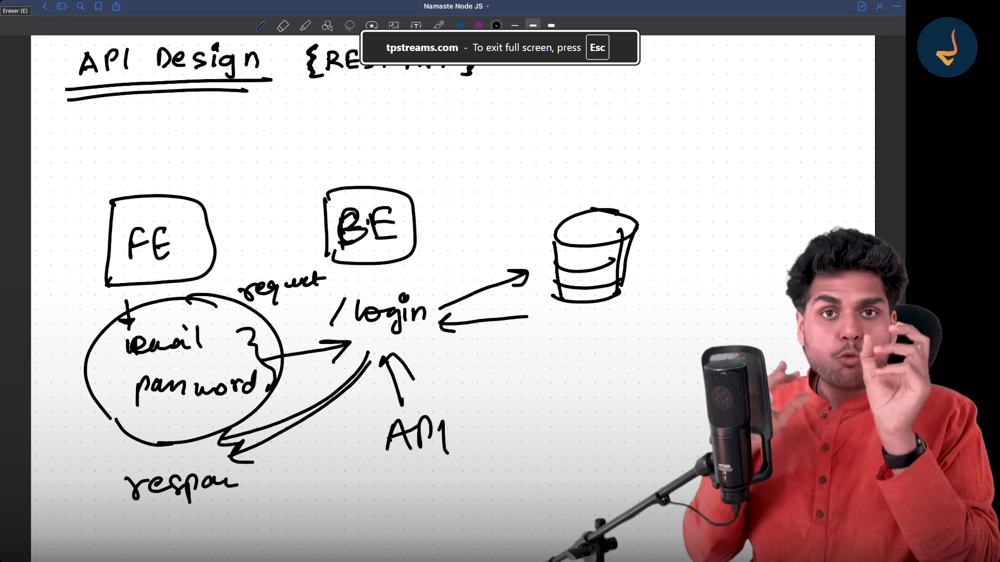
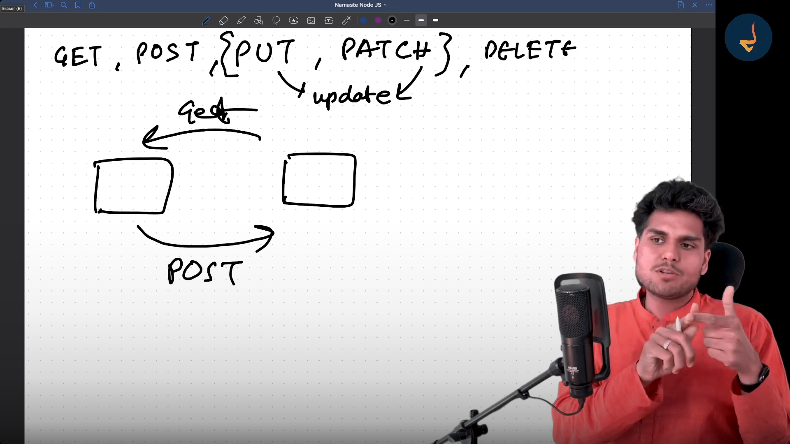

# DevTinder

Follow the Steps of Software Development Life Cycle (SDLC)

1. Requirements - 
    a. Create an Account
    b. Login
    c. Update Your Profile
    d. Feed Page - Explore 
    e. Send Connection Request
    f. See Due Matches
    g. See the request we've Sent/ Received

2. Design
    Tech Planning
    1. 2 Microservice One Frontend and One Backend
    2. Backend - NodeJs, MongoDB
    3. Frontedn - React

3. Development
    LLD
    ## DB Design
    1. User ---> firstname,lastname,emailId,password,age,gender.....

    2. ConnectionRequest
    - From UserId
    - To UserId
    - Status = PENDING, ACCEPTED, REJECTED, IGNORED

## API Design {REST API}

HTTP METHOD

Different API Required

CRUD Operations

1. POST /signup
2. POST /login
3. GET /profile
4. POST /profile
5. PATCH /profile
6. DELETE /profile
7. POST /sendRequest ---> Ignore / Interested
8. POST /reviewRequest ---> Accept / Reject
9. GET /requests 
10. GET /connections
