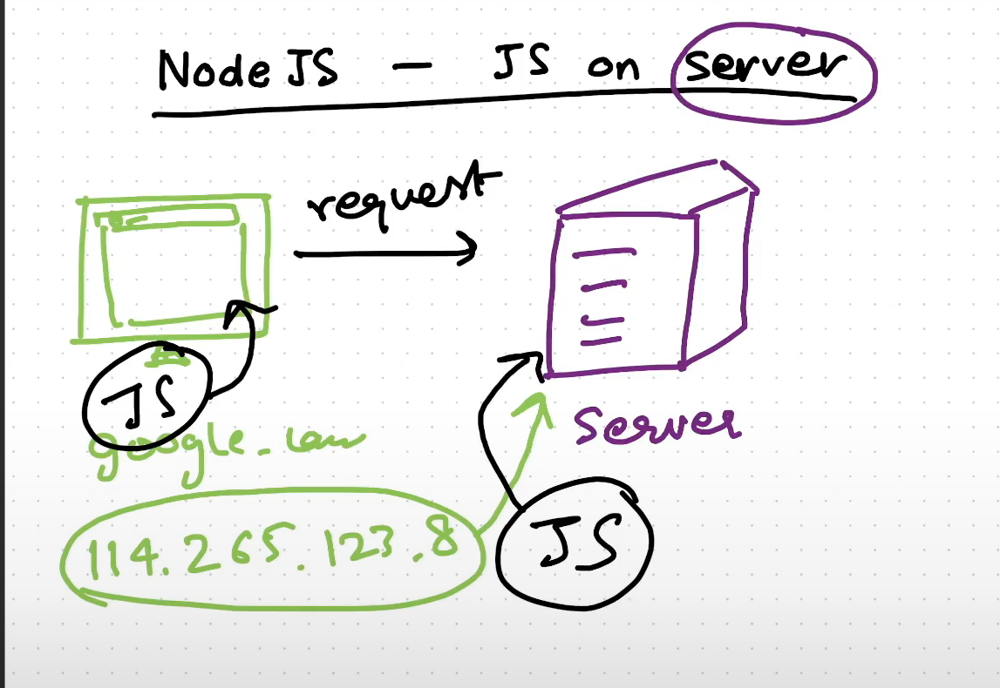
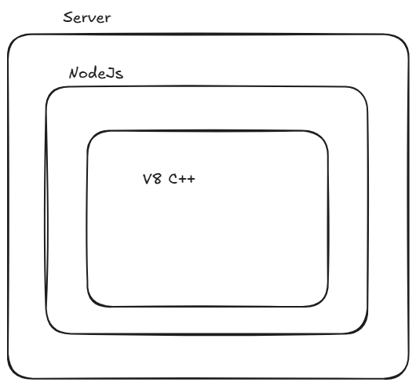
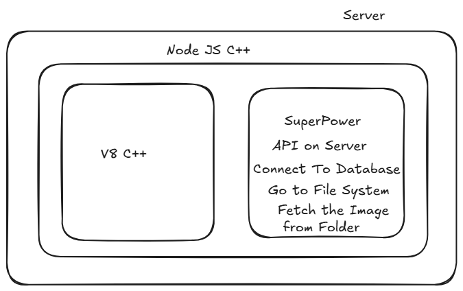
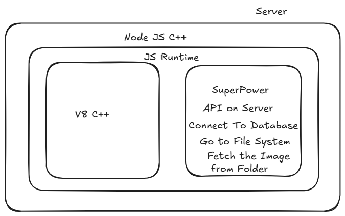
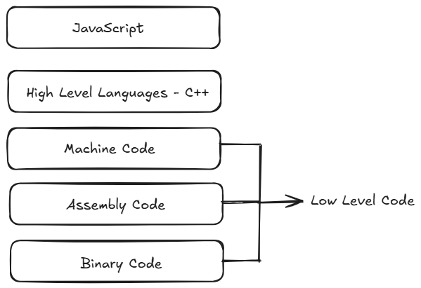
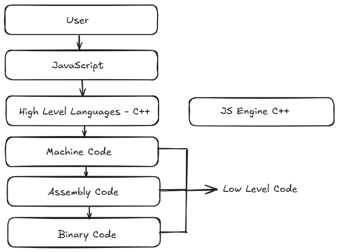

## JS on Server

What Actually a Server ? 

A Server means a Remote CPU working remotely

MEAN - MongoDB Express Angular Nodejs
MERN - MongoDB Express React Nodejs

Node.js is written in C++ code 
JS Engine - V8 (Google)  C++ Program

V8 can be embedded into any C++ application

What is V8?

V8 is Google's open source high-performance JavaScript and WebAssembly engine, written În C++. It is
used in Chrome and in Node.js, among others. It implements ECMAScript and WebAssembly, and runs on
Windows, macOS, and Linux systems that use x64, IA-32, or ARM processors. V8 can be embedded into
any C++ application.

-----------> JS -----------> V8 (C++) -------------------> Machine Level Code

Node JS is a C++ application with V8 embedded into it

What is EcmaScript ?

ECMAScript is a standard for scripting languages, including
JavaScript, JScript, and ActionScript. It is best known as a JavaScript standard intended
to ensure the interoperability of web pages across different web browsers. It is
standardized by Ecma International in the document ECMA-262.

ECMAScript Standards

1. Standards / Rules
   (JS Engines follow these standards)
2. V8 - Google
3. SpiderMonkey - Firefox
4. Chakra - MS, IE
5. JS Core - Safari

All these Engines have to follow the EcmaScript Standards

Why V8 is a C++ Code ??

                             