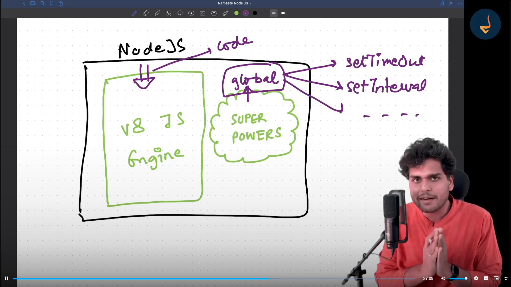
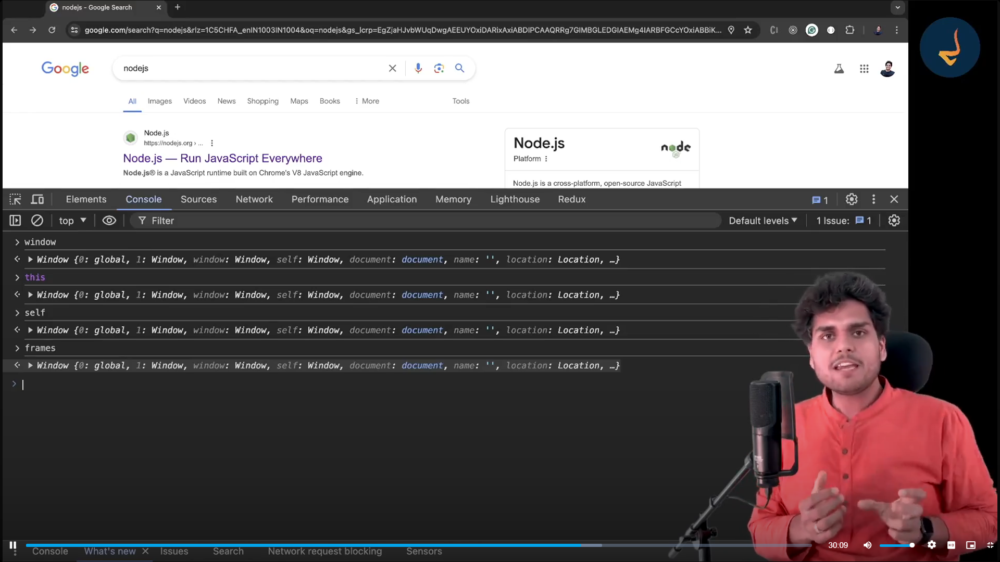

To write NodeJs Code Use

Node REPL (Read, Evaluate, Print, Loop)

to enter Node REPL write Node in Command Prompt

## Node JS is JavaScript Runtime Environment

to run a file using node use command 

node app.js

Global Object ---> window  ------> is inside browser
Global Object ---> global  ------> is in nodejs

