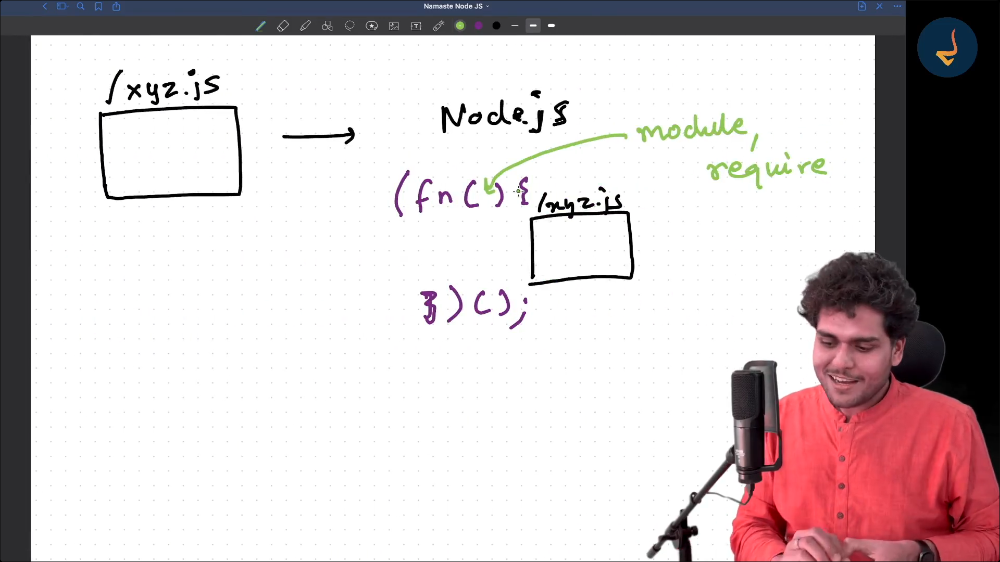
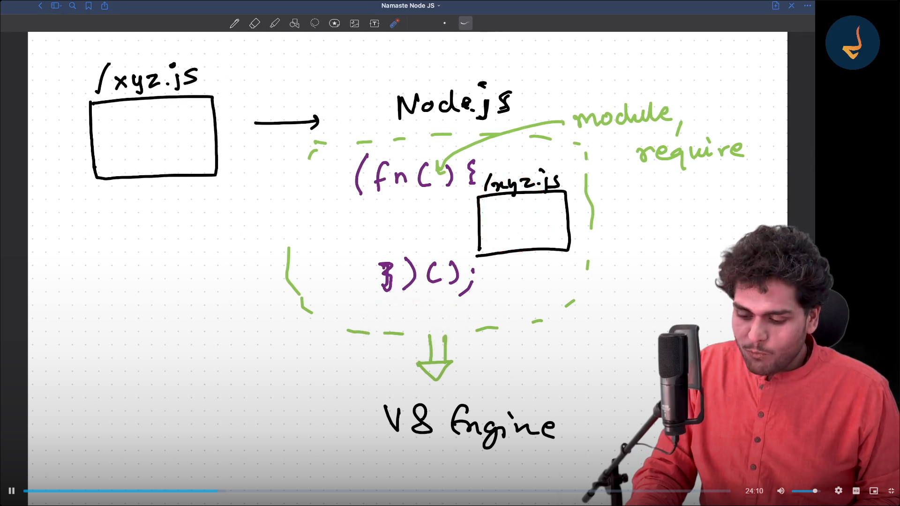

# Diving into the Node.js github repo

require("./path")
1. All the code of the module is wrapped inside a function when you call require and than it the function is executed
2. This Function is not normal function it is IIFE
3. IIFE - Immediately Invoked Function Expression

IIFE

```javascript
(function(module,require){

    // All code of the module runs inside this function
    require(path);

    function calculateMultiply(a,b){
        const result = a * b;
        console.log(result)
    }

    module.exports = {calculateMultiply};
})(module);
```

## IIFE Benefits
1. Immediately Invokes the Code.
2. Privacy - Keeps Variable and functions Safe


Questions
1. How are variables and function private in different module ? 
---> IIFE and require statement

2. How do you get access to module.exports ?
----> Parameters of module and require are given by node
Ans . NodeJs passes module as a parameter to the IIFE






### 5 Steps Mechanism of require(/path)

1. Resolving the Module
    a. checks if
    i. ./localpath
    ii. .json
    iii. node:module (internal module)

2. Loading the Module
    a. File Content is loaded according to file type

3. Compile and Wrap inside IIFE

4. Evaluation
    a. module.exports happens that means it is returned

5. Caching  ...VVIMP
    A. Suppose you have require a xyz file in one module it does all the above process and if it is require again than node does not do all the process again it just return the cached require again

## Require Code in NodeJs Github Repo
lib/internal/modules/cjs/loader.js
