# libuv & async IO

Node.js has an event-driven architecture capable of asynchronous I/O. These design
choices aim to optimize throughput and scalability in web applications with many
input/output operations, as well as for real-time Web applications (e.g., real-time
communication programs and browser games).

### JavaScript is a synchronous Single Threaded Language

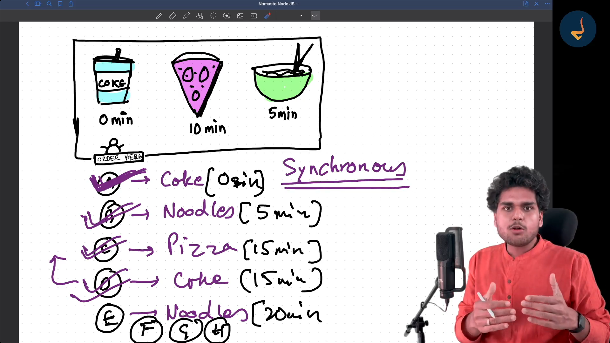

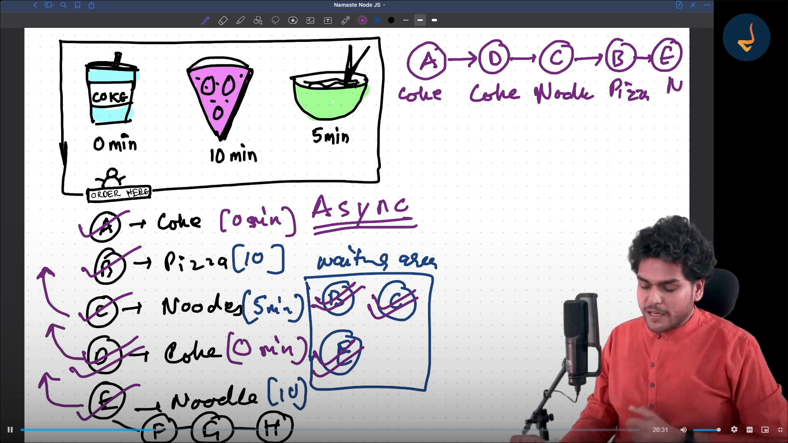

### JavaScript is Synchronous but with superpower of Node Js it becomes Asynchronous

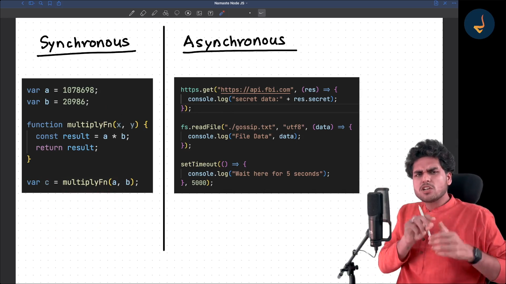

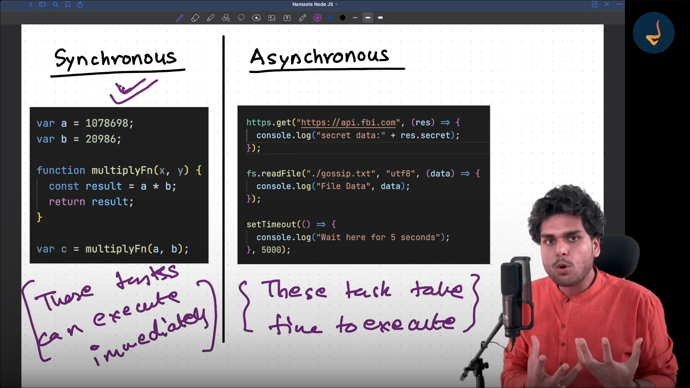

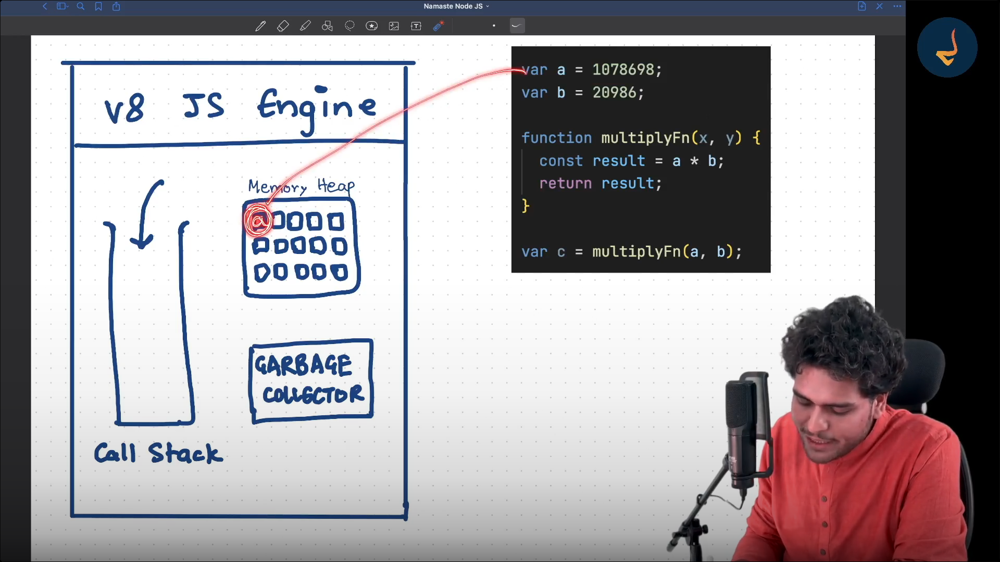

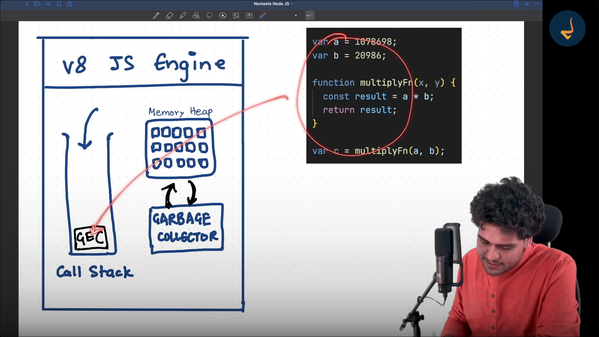

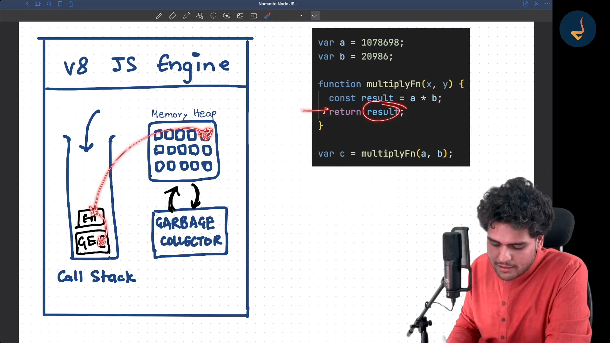

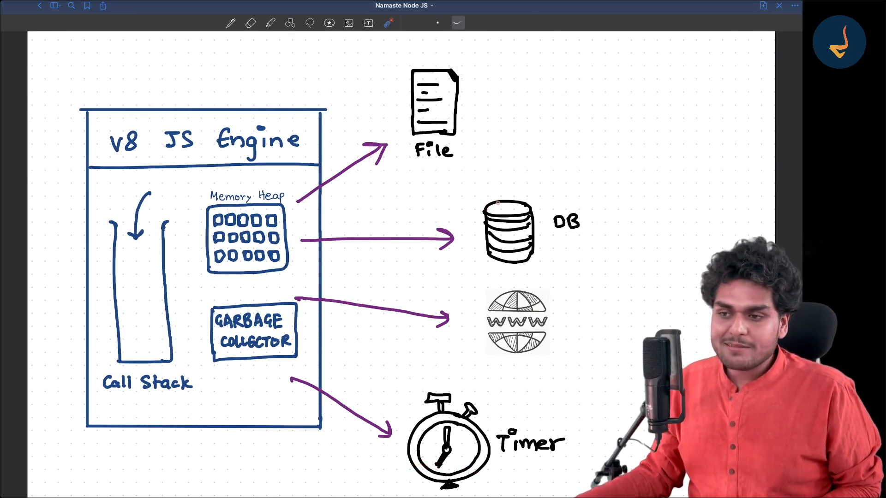

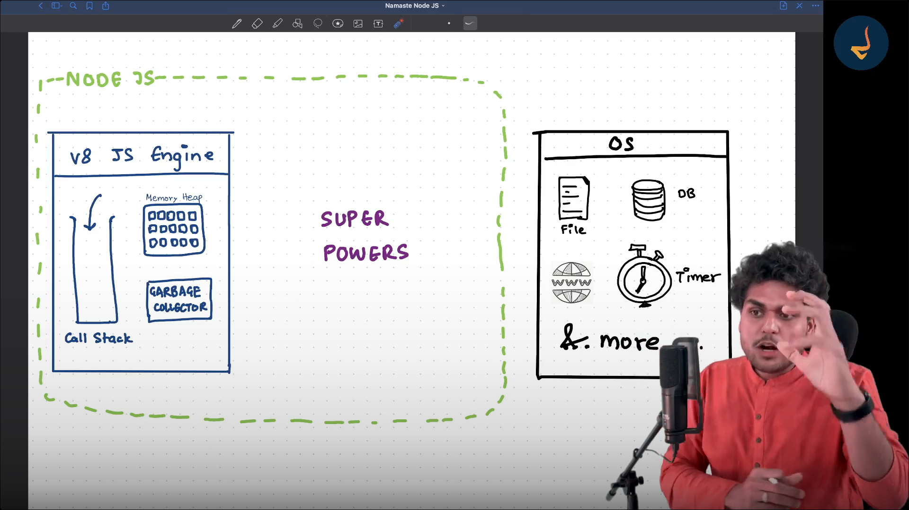

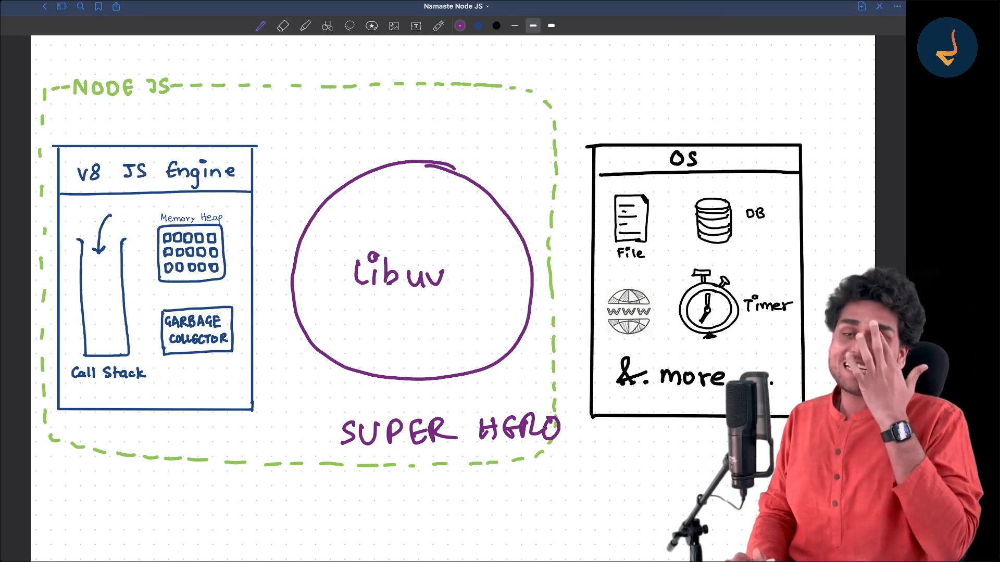

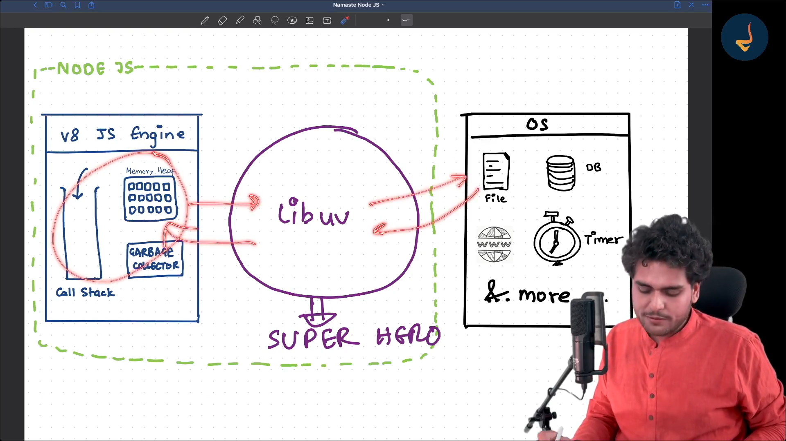

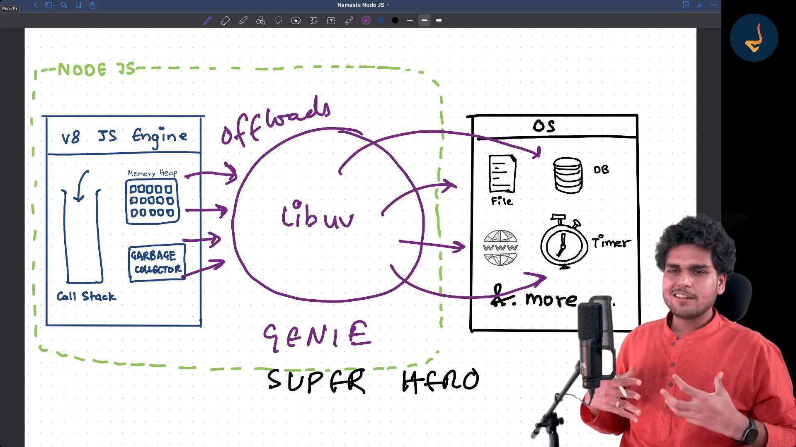

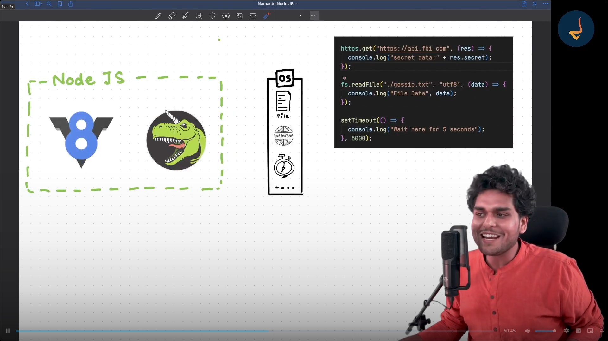

Libuv acts as a middle layer and talk to the Operating System and gets back the response and give it to NodeJs

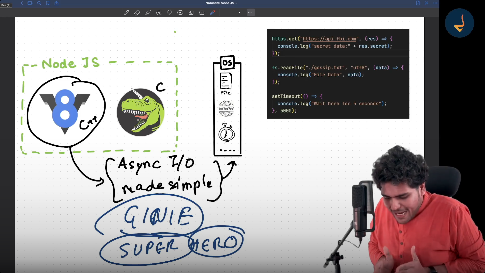

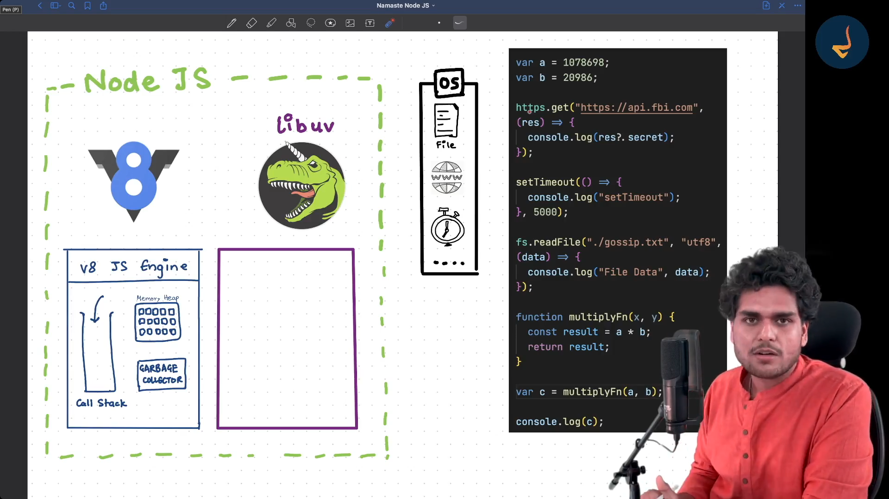

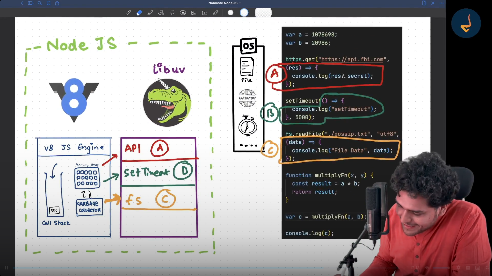

Node Js can do Asyncronous I/O - Input Output or Non Blocking I/O

Node Js has concept of Non Blocking IO using V8 Engine and Libuv