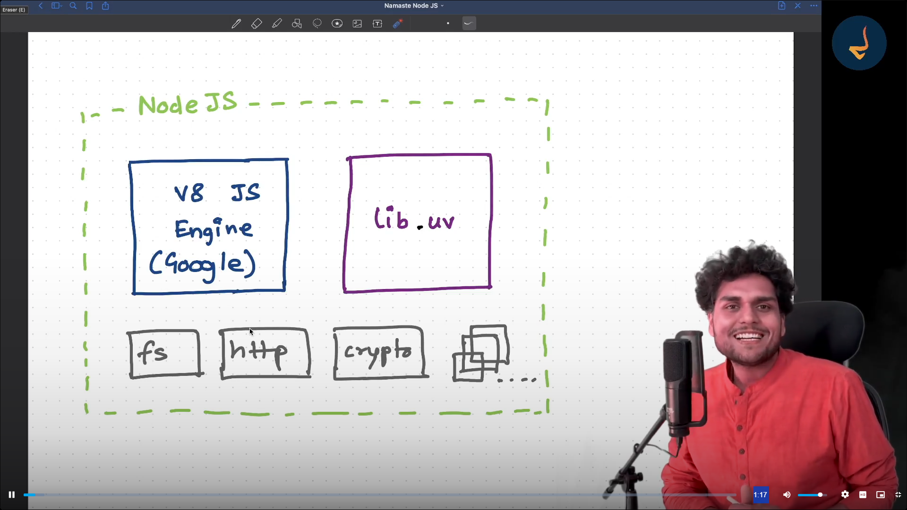
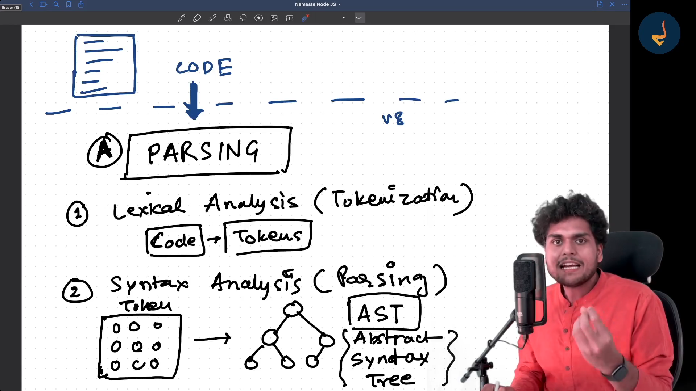
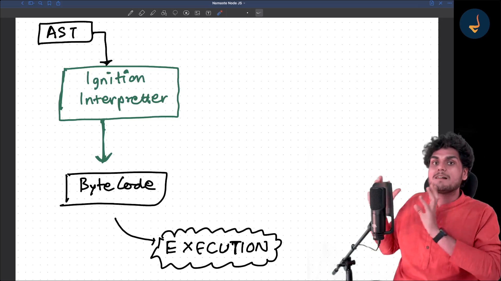
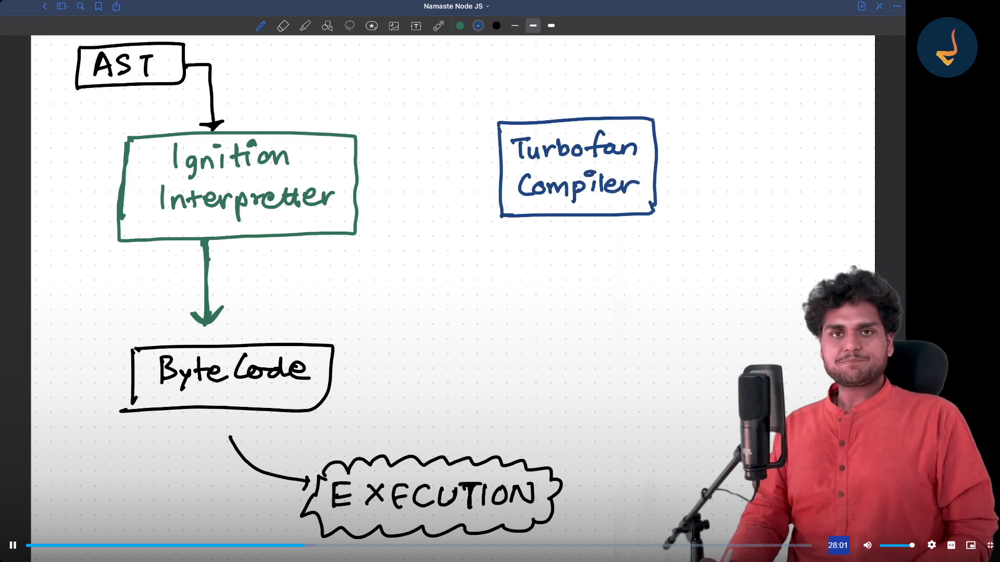
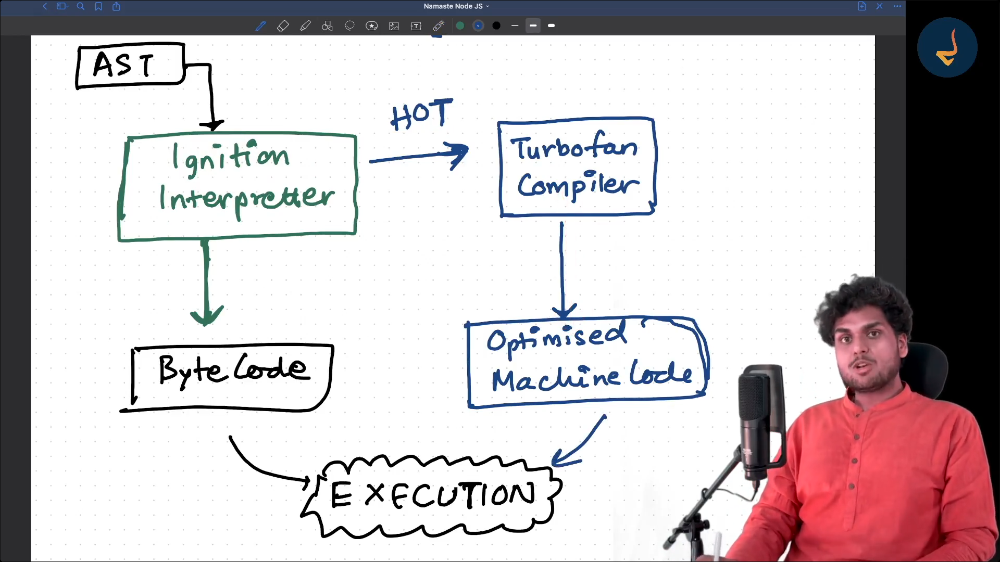
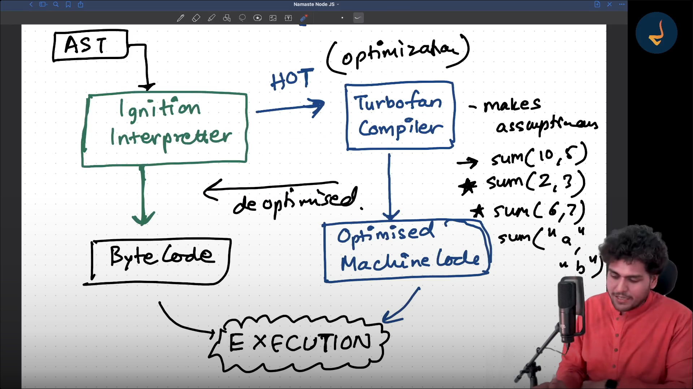
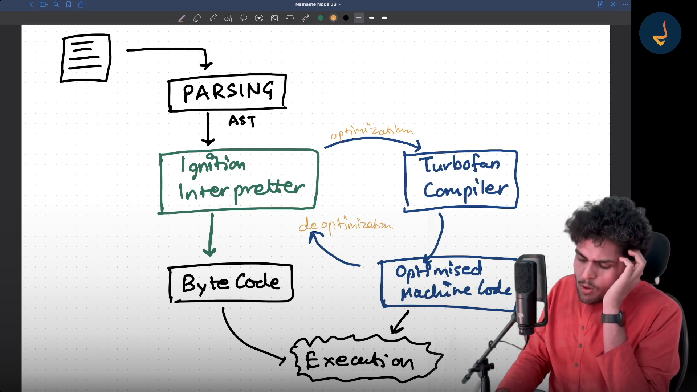
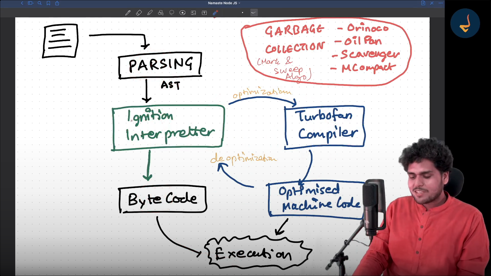
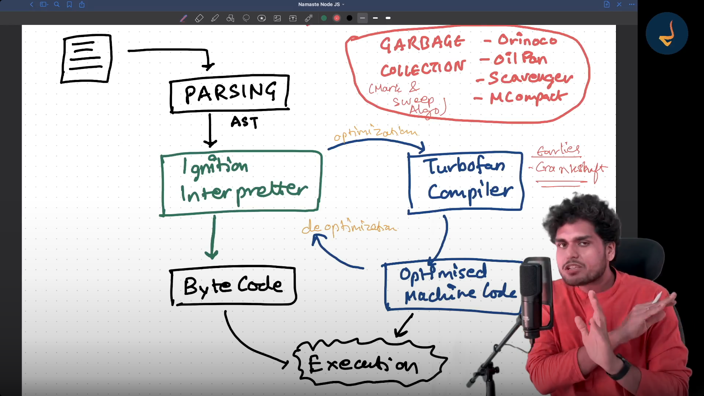

# Deep dive into v8 JS Engine

Flow when code is given to JavaScript Engine

A.  Parsing
1. Lexical Analysis (Tokenization) also known as Tokenization
    Code ----> Tokens
    The code that you give is broken down into tokens so this is known as lexical tokens

2. Syntax Analysis (this step is known as Parsing)
    Your tokens are then converted in to Abstract Syntax Tree (AST)

    

    Website which create ast is astexplorer.net

There are two types of languages

1. Interpreted Language
2. Compiled Language

____________________________________________

|Interpretted Language | Compiled Language |
|------------------------|------------------|
| line by line    | first compilation High Level Code is converted into maching code      |
| Fast Initial Execution  | Initially Heavy but executed fast |
| Interpretter | Compiler  |

## JavaScript has both Interprettor and a Compiler and it has JIT Compilation known as (Just In Time). JavaScript is a Just In Time Compiled Language

Whenever you give your code to JavaScript Engine first of all AST is built and now that AST is given to Ignition Interpretter now Ignition Interpretter starts reading the code line by line and starts converting it into byte code thats how ignition interpretter works when Ignition Interpretter runs it code it recognizes the code which is used alot the code which is executed again and again and than Ignition Interpretter tries to give that code to Turbofan Compiler so that we can compile and optimized that code so whenever it runs next time it just executes very very fast 

The code which executes fast is known as HOT code and it is given to TurboFan Compiler and it converts it to Optimised Machine Code

## What is Inline Caching and Copy Elision in JavaScript Engine ? 

