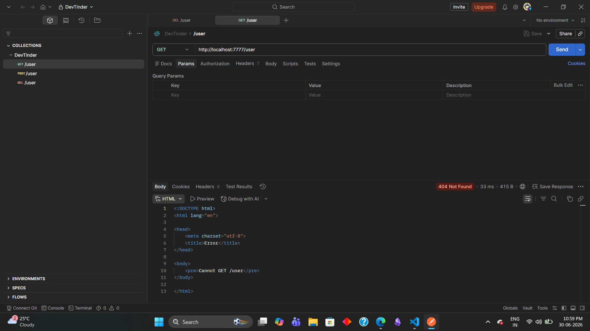

# Routing and Request Handlers
```javascript
const express = require("express");

const app = express();

app.use(
  "/user",
  (req, res, next) => {
    // Route Handler
    // res.send("Route Handler 1");
    console.log("Handling the route user!!");
    // res.send("Response!!");
    next();
    // res.send("Response!!");
  },
  (req, res, next) => {
    // Route Handler 2
    console.log("Handling the route user 2!!");
    // res.send("2nd Response!!");
    next();
  },
  (req, res, next) => {
    // Route Handler 3
    console.log("Handling the route user 3!!");
    // res.send("3rd Response!!");
    next();
  },
  (req, res, next) => {
    // Route Handler 4
    console.log("Handling the route user 4!!");
    // res.send("4rd Response!!");
    next();
  },
);


// 1:22 minutes

app.listen(7777, () => {
  console.log("Server is successfully listening on port 7777...");
});

```
